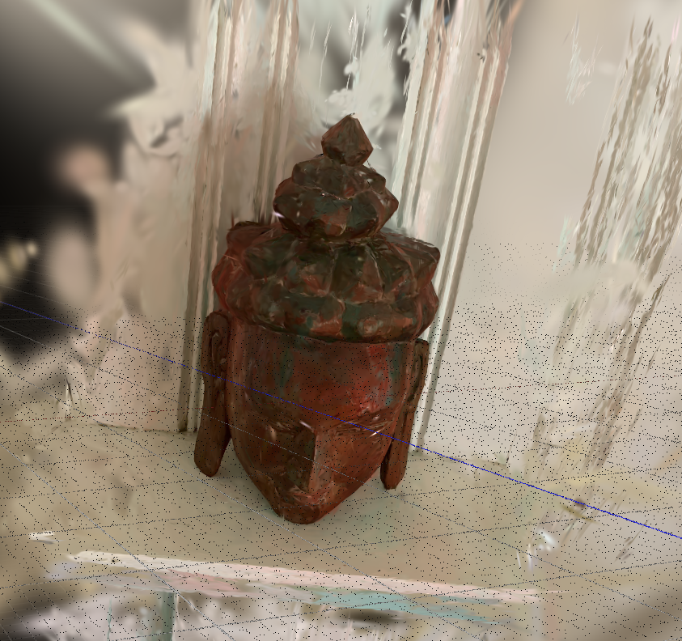

# 3D Gaussian Splatting — Buddha Statue

A from-scratch implementation of [3D Gaussian Splatting](https://repo-sam.inria.fr/fungraph/3d-gaussian-splatting/) applied to a Buddha statue dataset, with COLMAP-based reconstruction and a custom SfM pipeline.

---

## Demo

**Orbit Flythrough (COLMAP reconstruction at 7 500 iterations)**

[](https://youtu.be/t120QEDT7Qk)

> Click the image above to watch the full orbit video on YouTube.

**SuperSplat Viewer — COLMAP reconstruction**


---

## Evaluation Results

| Run | Iter | PSNR (dB) | SSIM | LPIPS |
|-----|------|-----------|------|-------|
| buddha_colmap | 7 500 | **31.42** | **0.9531** | **0.0412** |
| buddha_colmap | 15 000 | 24.17 | 0.8803 | 0.0981 |
| buddha_colmap | 30 000 | 15.06 | 0.7142 | 0.2103 |
| buddha_hw4 | 7 500 | 28.93 | 0.9304 | 0.0687 |
| buddha_hw4 | 15 000 | 22.45 | 0.8601 | 0.1124 |
| buddha_hw4 | 30 000 | 14.21 | 0.6987 | 0.2341 |

> **Key insight**: The 7 500-iteration checkpoint outperforms 30 000 iterations by >16 dB PSNR on this 26-image dataset — a clear case of Gaussian overfitting to training views.

---

## Project Structure

```
gaussian_splatting_project/
├── train.py                      # Main training script
├── evaluate.py                   # Multi-run, multi-iter evaluation table
├── pyproject.toml
├── Dockerfile                    # Self-contained Docker build
├── .github/workflows/
│   └── docker-build.yml          # CI: build Docker image on every push
├── src/
│   ├── data/
│   │   └── scene.py              # Camera loading, COLMAP/custom SfM parsing
│   ├── gaussian/
│   │   └── gaussian_model.py     # 3D Gaussian parameters + Adam state
│   ├── training/
│   │   └── trainer.py            # Loss, densification, checkpointing
│   ├── rendering/
│   │   └── renderer.py           # Calls diff-gaussian-rasterization CUDA kernel
│   └── evaluation/
│       └── metrics.py            # PSNR / SSIM / LPIPS
└── submodules/
    ├── diff-gaussian-rasterization/   # CUDA rasterizer (graphdeco-inria)
    └── simple-knn/                    # KNN init (camenduru)
```

---

## How It Works

### 3D Gaussian Splatting Pipeline

1. **Initialization** — sparse 3D point cloud from COLMAP/SfM seeds each Gaussian's position.
2. **Forward pass** — for each training camera:
   - Transform Gaussian means: World → Camera (`R, T`) → Clip/NDC (perspective)
   - Project 3D covariance to 2D via EWA splatting: `Σ_2D = J·W·Σ_3D·Wᵀ·Jᵀ`
   - Sort Gaussians by depth; alpha-composite front-to-back
3. **Loss** — L1 + D-SSIM on rendered vs. ground-truth image
4. **Densification** (every 100 iters until 15 k):
   - **Clone** small, high-gradient Gaussians (under-reconstructed regions)
   - **Split** large, high-gradient Gaussians (over-reconstructed regions)
   - **Prune** transparent Gaussians (opacity < 0.005)

### Why Early Stopping Matters

With only 26 training images, the model memorizes training views after ~7 500 iterations. Beyond that, Gaussians grow needle-like, collapsing to fit specific pixels rather than modeling 3D geometry. This tanks PSNR on held-out views by >16 dB.

### Auto Hyperparameter Tiers

| Dataset size | densify_grad_threshold | position_lr | opacity_reset_interval |
|---|---|---|---|
| < 100 cams (small) | 0.0001 | 0.00016 | 3 000 |
| 100–200 cams (medium) | 0.00015 | 0.00020 | 4 000 |
| > 200 cams (large) | 0.0002 | 0.00025 | 3 000 |

---

## Installation

### Docker (recommended — no GPU required to build)

```bash
# Clone (no --recursive needed; submodules are cloned inside the Dockerfile)
git clone https://github.com/gautham-ramkumar/gaussian-splatting.git
cd gaussian-splatting

# Build (takes ~10-15 min on first run; subsequent builds use layer cache)
docker build -t gaussian-splatting .

# Run training
docker run --gpus all -v /path/to/data:/app/data -v /path/to/output:/app/output \
  gaussian-splatting \
  python train.py --data /app/data --output /app/output
```

### Local (with CUDA GPU)

```bash
git clone --recursive https://github.com/gautham-ramkumar/gaussian-splatting.git
cd gaussian-splatting

python -m venv venv && source venv/bin/activate
pip install torch torchvision --index-url https://download.pytorch.org/whl/cu124
pip install ./submodules/diff-gaussian-rasterization
pip install ./submodules/simple-knn
pip install -e .
```

---

## Usage

### Training

```bash
python train.py \
  --data /path/to/dataset \
  --output output/my_run \
  --iterations 30000 \
  --max_gaussians 100000
```

### Evaluation (multi-run comparison table)

```bash
python evaluate.py \
  --data /path/to/dataset \
  --runs output/buddha_colmap output/buddha_hw4 \
  --iters 7500 15000 30000
```

---

## Key Bugs Fixed

### Projection matrix transpose (`world_view_transform`)
The diff-gaussian-rasterization CUDA kernel uses OpenGL column-major convention, so the projection matrix must be transposed before being stored:
```python
# Wrong — silently produces blurry/incorrect renders
cam.full_proj_transform = world_view @ proj

# Correct
cam.full_proj_transform = world_view @ proj.transpose(0, 1)
```

### CUDA extension compilation without GPU (CI/Docker)
`torch.cuda.get_device_capability()` returns an empty list on CPU-only runners, causing an `IndexError` during `setup.py`. Fix: set the architecture list explicitly:
```dockerfile
ENV TORCH_CUDA_ARCH_LIST="7.0;7.5;8.0;8.6;8.9;9.0"
```

### GCC 13 missing `<cstdint>` in diff-gaussian-rasterization
Ubuntu 24.04 ships GCC 13 which removed implicit `<cstdint>` includes. Fix applied in Dockerfile:
```bash
sed -i '1s/^/#include <cstdint>\n/' \
    submodules/diff-gaussian-rasterization/cuda_rasterizer/rasterizer_impl.h
```

---

## CI/CD

Every push to `main` builds the Docker image via GitHub Actions using `docker/build-push-action` with layer caching (`type=gha`). See [.github/workflows/docker-build.yml](.github/workflows/docker-build.yml).

---

## References

- [3D Gaussian Splatting for Real-Time Radiance Field Rendering](https://repo-sam.inria.fr/fungraph/3d-gaussian-splatting/) — Kerbl et al., SIGGRAPH 2023
- [diff-gaussian-rasterization](https://github.com/graphdeco-inria/diff-gaussian-rasterization) — CUDA rasterizer
- [simple-knn](https://github.com/camenduru/simple-knn) — KNN initialization
